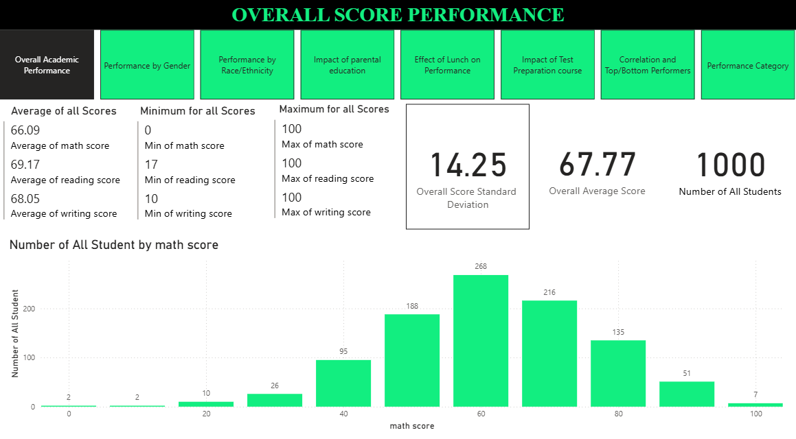
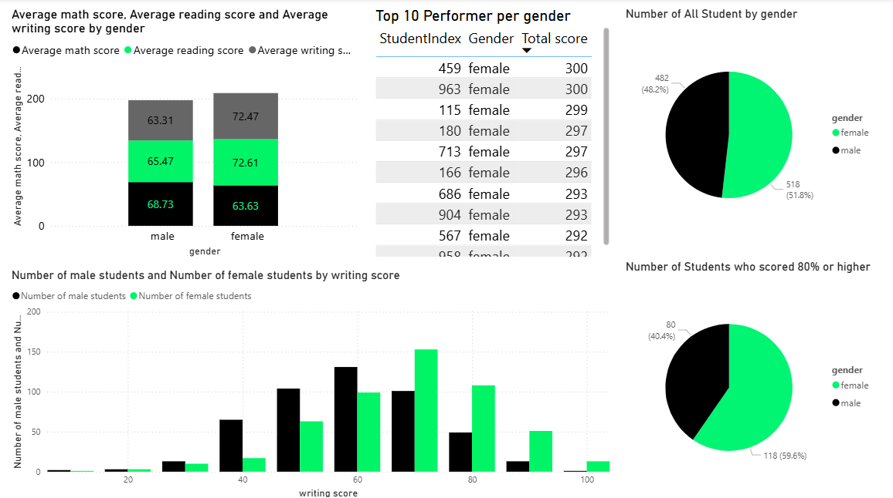
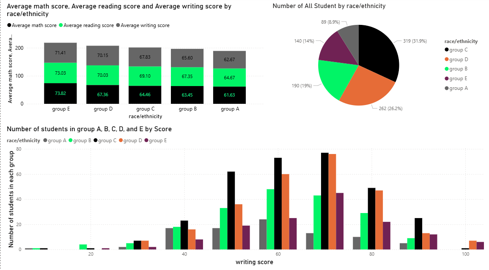
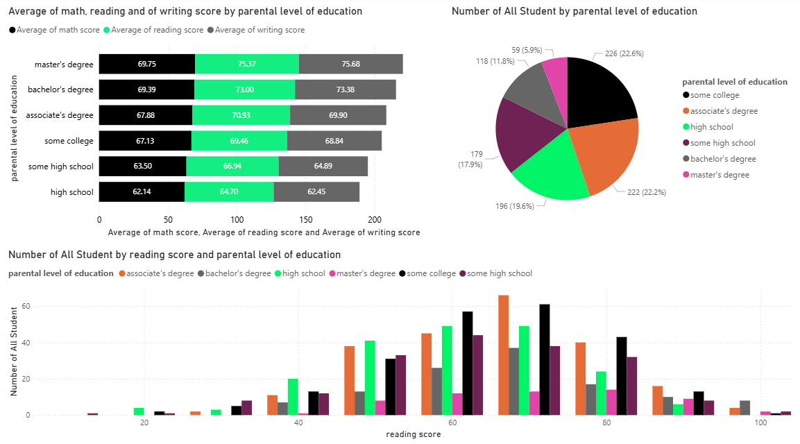
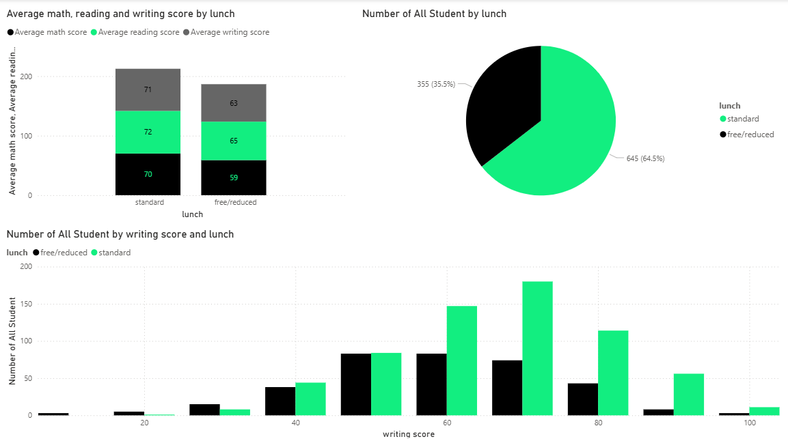
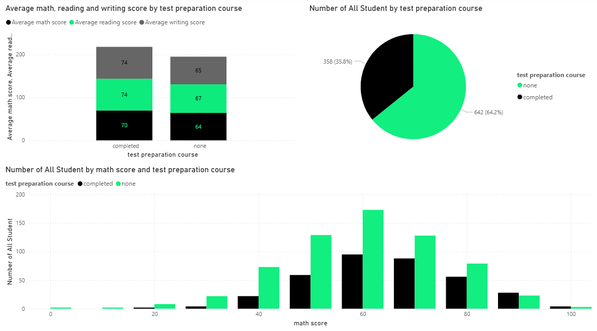
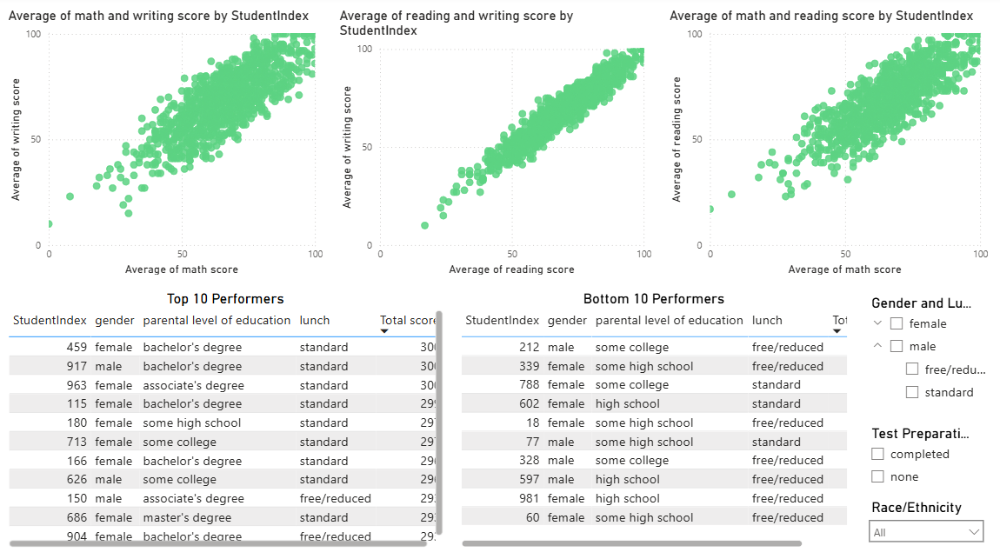
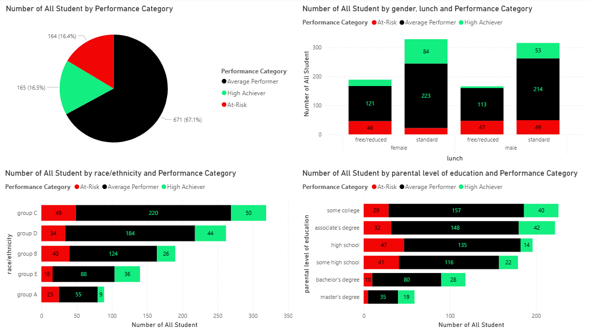

# Student-Performance-with-Power-BI
Power BI analysis of student performance dataset
---
📊 Project Overview
The dashboard explores how factors such as **gender**, **parental education**, **lunch type**, **Race/Ethnicity**, and **Test Preparation course** affect student scores in **Math**, **Reading**, and **Writing**.

🧠 Key Insights

- Students with **standard lunch** generally achieve **higher scores** across all subjects.
- **Parental education level** shows a positive correlation with student performance.
- The distribution of scores is approximately **normal**, with slight variations across subjects.

---

## 🛠️ Tools & Technologies
- **Power BI Desktop**
- **DAX (Data Analysis Expressions)**
- **Excel / CSV Data Source**
- **GitHub** for version control and project sharing

---

## 📁 Dataset
Dataset Information
The dataset used in this project was obtained from [Kaggle](https://www.kaggle.com/datasets/saadaliyaseen/exploring-student-achievement-trends/data), originally published as part of Exploring Student Achievement Trends dataset.
The dataset used contains information on:
- Gender  
- Parental education level  
- Lunch type  
- Test preparation  
- Math, Reading, and Writing scores  

> *Note: The dataset is for educational purposes only.*

#### 📁 StudentPerformanceAnalysis/

├── README.md                                     – Summary overview  
├── FullReport.md                                   – Detailed analysis  
├── StudentsPerformance_Project.pbix   – Power BI Dashboard  
├── StudentsPerformance.xlsx                 – Original dataset  
└── screenshots/  
  
For detailed analysis of score distributions, gender, race, lunch type, and parental education, see the [Full Report](FullReport.md).

## 👤 Author
**Dieudonné Nahimana**  
📧 [nahimana.dieudo@gmail.com](donnenahi@gmail.com)  
🌐 [LinkedIn Profile](https://www.linkedin.com/in/nahimana-dieudonn%C3%A9-99b4a9200/)

## 📊 Dashboard Preview

#### 🎯 Overview Dashboard

#### 👩‍🎓 Gender Performance Dashboard

#### 🌍 Race Performance Dashboard

#### 🎓 Parental Education Dashboard

#### 🍱 Lunch Effect on Performance Dashboard

#### 🧠 Test Preparation Impact Dashboard

#### Score Correlation Dashboard

#### Performance Category Dashboard

